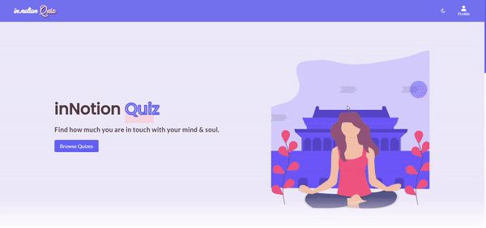

  
  <h1><a href="https://innotion-quiz.netlify.app/">inNotion Quiz</a> - Self Care Quiz App</h1>
    
Quiz application to check your knowledge on your self-care journey with topics like meditation, productivity, mindfullness, etc!

 

  <h2>Preview☀️</h2>
  
 

## Available Screens
- Landing Page
- Quiz Category Page
- Rules Page
- Question Page
- Result Page
- Scores Page
- Authentication (Login, Signup and Logout) Pages
- Page not found(404 page)

## Features:
Responsive screens with:
- **Landing Page** with list of featured categories & trending quizes.
- **Quiz Category Page** - with list of quizes listed under certain category.
- **Rules Page**, consists of rules for particular game being played.
- **Question Page** - List of MCQ based question for user to choose from.
- **Result Page** - Answers of the following quiz mentioned along with total score.
- **Scores Page** - Scores of the played game will be stored here for user.

## Technologies & Concepts used

- React JS with useReducer + useContext
- Typesscript
- Firebase for Authentication
- React-router-dom
- React-toastify
- React-loader-spinner
- inNotion UI library for styled components.
To know about the styled components, their variations, read the [inNotion UI Documentation](https://innotion-ui.netlify.app/).
- Git For Version Control
- Netlify for Deployment

